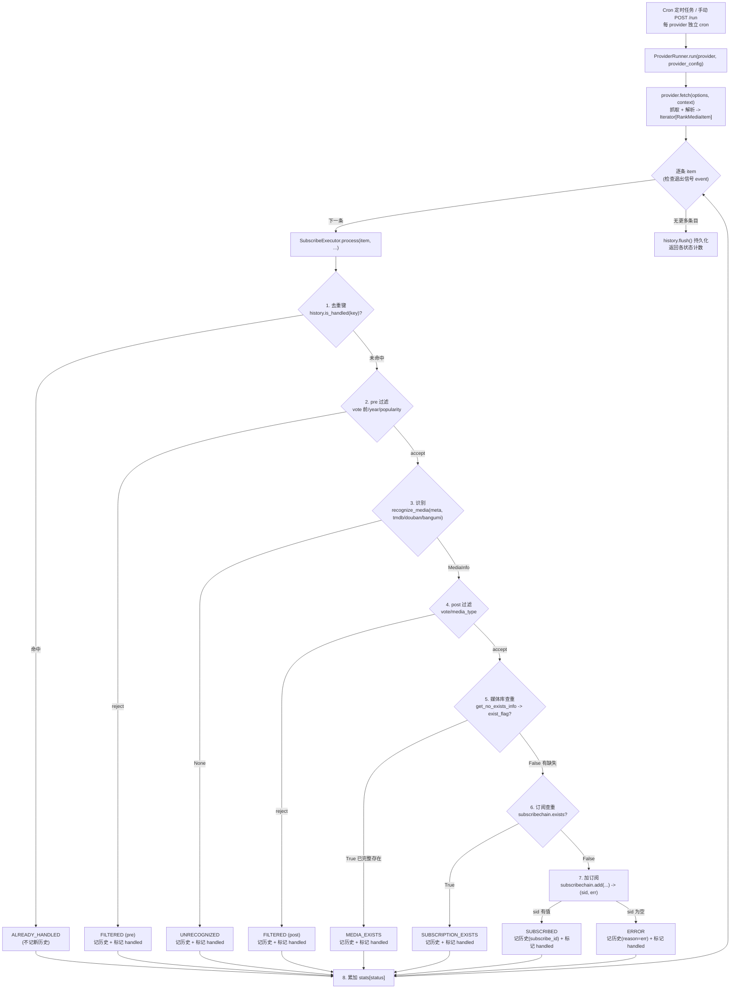
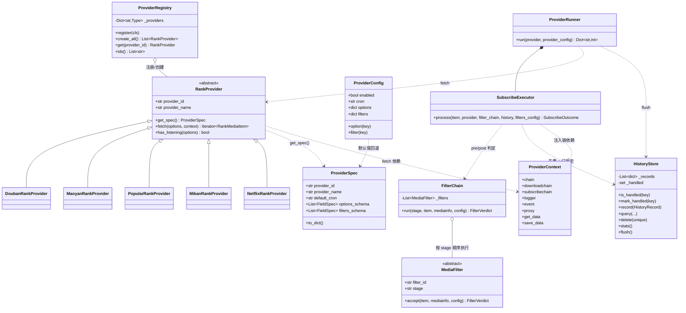

# 自动订阅助手 架构文档（Architecture）

> 插件：`AutomaticSubscriptionAssistant`
> 目录：`app/plugins/automaticsubscriptionassistant/`
> 事实源：本目录 `BUILD_SPEC.md` 与 `docs/superpowers/specs/2026-07-12-automaticsubscriptionassistant-design.md`

本插件统一聚合**豆瓣榜单 / 猫眼榜单 / 热门媒体 / Mikan 季度新番 / 奈飞榜单**五类来源，通过一条共享的落地管线完成「识别 → 查重 → 订阅 → 记历史」，并以可组合的两阶段过滤器链筛选条目。新增订阅源只需新增一个 `RankProvider` 子类，落地、过滤、历史与前端配置块全部复用。

---

## 1. 分层原则

插件采用**多文件抽象分层**，每一层职责单一、边界清晰，禁止跨层耦合：

| 层 | 文件 | 职责 | 明确不做 |
|----|------|------|----------|
| **入口层** | `__init__.py` | 解析配置、注册定时调度（`get_service`）、暴露 HTTP API（`get_api`）、编排 `run_provider` | 不含抓取细节、不含落地细节 |
| **provider 层** | `providers/*.py` | 只负责「抓取 + 解析成标准中间条目 `RankMediaItem`」，可能尚未带 `tmdbid` | 不碰识别、不碰订阅落地、不写历史 |
| **filter 层** | `core/filters.py` | 只返回判定结果 `FilterVerdict`（accept / reject + 原因） | 不写状态、不加订阅、不改条目 |
| **executor 层** | `core/executor.py` | 唯一落地管线：去重键 → pre 过滤 → 识别 → post 过滤 → 媒体库查重 → 订阅查重 → 加订阅 → 记历史 | 不抓取、不解析源数据 |
| **runner 层** | `core/runner.py` | 编排单源：`fetch` → 逐条 `executor.process`，累加状态计数，尊重退出信号，结束 `flush` | 不实现落地/过滤具体逻辑 |
| **history 层** | `core/history.py` | 封装 `get_data('history')` / `save_data`，维护去重键集合，支持查询/删除/清空/统计 | 不参与落地判定 |

支撑模块：

- `core/models.py`：全部数据模型（`RankMediaItem`、`ProviderSpec`、`FieldSpec`、`FilterVerdict`、`SubscribeOutcome`、`HistoryRecord`、`SubscribeStatus`）。
- `core/config.py`：类型安全配置访问器（`TypedConfigAccess`）+ `GlobalConfig` / `ProviderConfig` / `PluginSettings` + 反射生成默认值 `build_defaults`。
- `core/provider.py`：`RankProvider` 抽象基类 + `ProviderContext`（运行期依赖注入）。
- `core/registry.py`：`ProviderRegistry` 注册与发现（模块级单例 + `@register` 装饰器）。

分层的核心收益：**五源共享同一条尾部管线**（原 `popularsubscribe` / `doubanrankplus` / `maoyanrank` 等插件各自重复的「识别 → 查重 → 订阅 → 记历史」被收敛为唯一实现），新增源的边际成本降到最低。

---

## 2. 数据流（flowchart）

一次运行由「每 provider 独立 cron 定时任务」或「手动 `POST /run`」触发，进入 `ProviderRunner`，拉取条目后逐条走 `SubscribeExecutor.process` 的严格顺序管线：

要点：

- **步骤严格按序**，任一步命中即短路返回对应状态，不再执行后续步骤。
- **`get_no_exists_info` 语义反直觉**：返回 `True` 表示媒体库已「完整存在」（应跳过），`False` 表示有缺失（可订阅）。
- 每条 item 都包在 `try/except` 内，单条异常 → `ERROR` 状态并 `continue`，不影响整源。
- `ALREADY_HANDLED` 是唯一「不写新历史」的分支（去重键已在集合内）。

---

## 3. 组件关系（classDiagram）

核心抽象与其协作关系如下（省略字段细节，突出结构）：

协作叙述：

- `ProviderRegistry` 持有各 `RankProvider` 子类，`create_all()` 实例化全部源；`providers/__init__.py` 的 `import` 触发 `@register` 注册。
- `ProviderRunner` 组合一个 `SubscribeExecutor`，先调 `provider.fetch`，再对每条 item 调 `executor.process`。
- `SubscribeExecutor` 依赖 `FilterChain`（pre/post 两阶段判定）、`HistoryStore`（去重与记录）、`ProviderContext`（注入 `chain` / `downloadchain` / `subscribechain`；并注入插件 KV 读写 `get_data` / `save_data`，供 provider 持久化缓存，如奈飞两级缓存的 L2）。`get_data` / `save_data` 由 `__init__.run_provider` 构造 `ProviderContext` 时从插件基类传入，可能为 None（测试 / 无 KV 时禁用持久化，现有位置参数构造不受影响）。
- `ProviderConfig` 依据 `ProviderSpec` 的 `options_schema` / `filters_schema` 做默认值回退，杜绝「表单字段」与「配置读取」漂移。

---

## 4. 五个 Provider

五源共用统一的 `RankProvider.fetch` 契约，产出标准化的 `RankMediaItem`（可能未带 `tmdbid`，识别交由 executor 完成），差异只在数据源与解析：

### 4.1 `douban` — DoubanRankProvider（豆瓣榜单）

- **数据源**：RSSHub 豆瓣榜单 RSS（如 `movie-hot-gaia` 热门电影、`tv-hot` 热门电视剧、`movie-top250` 等，共 7 个内置榜单 + 用户自定义 `rss_addrs` 每行一个）。
- **默认 cron**：`0 8 * * *`。
- **要点**：用 `RequestUtils(timeout=240, proxies=...)` 拉取，`xml.dom.minidom` 解析 `<item>`；从 `<link>` 用正则 `/(\d+)/` 提取 `douban_id`，`year` 缺失时从 `description` 兜底正则；`type` 字段映射 `MediaType`。`unique_seed = f"{title}_{year}_(DB:{douban_id})"`。评分/季号在 executor 用 `recognize_media(doubanid=...)` 识别后由 `MediaInfo` 提供，故 `VoteFilter` 归 post 阶段。

### 4.2 `maoyan` — MaoyanRankProvider（猫眼榜单）

- **数据源**：猫眼票房/热度 API（`piaofang.maoyan.com`）——电影票房 `/dashboard-ajax/movie`、网络电影 `/dashboard/webMaoYanHotData`、网播热度 `/dashboard/webHeatData`（电视剧/网剧/综艺），支持平台细分（全网/腾讯/爱奇艺/芒果/优酷/搜狐/乐视/PPTV，笛卡尔积）。
- **默认 cron**：`0 9 * * *`。
- **要点**：先用 `PlaywrightHelper().action(...)` 取 Cookie（失败降级空 dict），再带 Cookie + UA 请求 JSON。电影票房 / 网络电影归 `MOVIE`，网播热度归 `TV`；`year` 由 `releaseInfo` 天数反推（`date.today() - timedelta(days=n)`）。TV 结果按 title 内存去重。`unique_seed = f"{mtype_value}_{title}_{year}"`。

### 4.3 `popular` — PopularRankProvider（热门媒体）

- **数据源**：MoviePilot 官方服务器订阅统计 `MoviePilotServerHelper.get_subscribe_statistic(stype, page, count, genre_id, min_rating)`（classmethod，受主程序全局 `settings.SUBSCRIBE_STATISTIC_SHARE`「订阅数据共享」门控，关闭时服务端直接返回 `[]`）。
- **默认 cron**：`5 1 * * *`。
- **要点**：
  - **`stype` 必须传中文**（`电影` / `电视剧`）——服务端只接受中文枚举，传英文 `movie`/`tv` 会返回空列表；provider 内用 `_STYPE_CN` 映射 `movie→电影`、`tv→电视剧`。返回项 `type` 亦为中文，`_map_media_type` 经 `MediaType.MOVIE.value == "电影"` 天然兼容。服务端统计仅电影 / 电视剧两类（动漫混在电视剧中、官方不单列，`MediaType` 枚举亦无「动漫」）。
  - 统计项已自带 `tmdbid` / `doubanid` / `bangumiid` 等标识，识别更快。
  - **配置按电影 / 剧集两大组独立**，字段 key 统一 `{category}_{enabled|genres|page_cnt|min_rating|popularity}`：`{category}_enabled` 开关独立控制订阅（缺省两类都开）；**风格标签** `movie_genres` / `tv_genres`（各自一套 TMDB genre，电影 19 / 剧集 16 项）下推 `genre_id`——空=全部，多选则逐 genre 分别请求、按 `unique_seed` 去重合并（`动画=16`）；`{category}_page_cnt` 独立获取条数；`{category}_min_rating`（按统计项 `vote`）、`{category}_popularity`（按 `source_meta["count"]` 订阅人次）**均在 provider 内本地过滤**。
  - **命中主程序『热门订阅』的同一份共享缓存**：请求走「无过滤基线」（`min_rating=None`、`genre` 为空时不带 `genre_id`），与主程序 `/subscribe/popular` 端点（同样调 `async_get_subscribe_statistic`）参数一致——二者共享同一进程内缓存（cache 装饰器规范化 `async_` 前缀、cache key 相同）。故评分下限改本地过滤而非下推服务端，既避免过滤 cache key 各自打空，也能直接命中前端已填充的缓存。
  - **空结果诊断**：门控关闭时提前告警并返回；已开启却为空时用原始请求读 `status_code`，日志区分「200 但无数据 / 连不上·超时 / HTTP 异常」，不再笼统。

### 4.4 `mikan` — MikanRankProvider（Mikan 季度新番）

- **数据源**：蜜柑计划（`mikanani.me`，备用 `mikanime.tv`）季度番剧页 `/Home/BangumiCoverFlowByDayOfWeek?year={year}&seasonStr={季}`（`seasonStr` 实测为中文季名 `春`/`夏`/`秋`/`冬`）+ 番剧详情页 `/Home/Bangumi/{mikan_id}`。API 移植自 `mikan_flutter` 的 `mikan.ts`，请求需带 Mikan 专用 UA（`... MikanProject/1.0.0`）。
- **默认 cron**：`0 10 * * 1`（季番每周更新，每周一抓一次）。
- **要点**：轻客户端 `MikanApi` 用 `RequestUtils(ua=MIKAN_UA)` 抓 HTML，`BeautifulSoup(html, "lxml")` 解析 `div.sk-bangumi li`：`span[data-bangumiid]`(Mikan id)、`a.an-text[title]`(中文标题)、`span[data-src]`(封面)、按星期分组的 `div.row` 文本(week)。`year=0` 取当前年，`season="当前"` 按当前月推导季度（1-3→冬 / 4-6→春 / 7-9→夏 / 10-12→秋）。`resolve_bangumi_id` 开启时逐条抓详情页、正则 `b(?:gm|angumi)\.tv/subject/(\d+)` 提取 bgm.tv subject id 填入 `bangumi_id`，每条间隔约 0.6s 并响应 `context.event` 退出信号；抓不到则 `None`，executor 退化为标题+年份识别。番剧统一 `MediaType.TV`，`unique_seed = mikan_id`。识别由 executor 走 `recognize_media(bangumiid=...)`（bangumi→tmdb 桥接）。

### 4.5 `netflix` — NetflixRankProvider（奈飞榜单）

- **数据源**：Netflix 官方 Tudum Top10 公开 TSV（GET，无鉴权，制表符分隔、首行表头）：`most-popular.tsv`（全球·史上最热·不分周，列 `category rank show_title season_title ...`）、`all-weeks-global.tsv`（全球·每周·近 5 年，列 `week category weekly_rank show_title season_title ...`）、`all-weeks-countries.tsv`（94 国·每周·近 5 年，列 `country_name country_iso2 week category weekly_rank show_title season_title ...`，**约 30MB**）。全球 category 有 4 种（`Films (English)` / `Films (Non-English)` / `TV (English)` / `TV (Non-English)`），国家 category 有 2 种（`Films` / `TV`）。
- **默认 cron**：`0 11 * * 3`（Top10 每周更新，每周三抓一次）。
- **要点**：`_load_tsv` 用 `RequestUtils(proxies=settings.PROXY if proxy else None, timeout=120)` 抓取，并**强制按 UTF-8 从 `ret.content` 解码**（Netflix TSV 响应头不带 charset，直接取 `.text` 会被 requests 兜底成 ISO-8859-1 而误解码 UTF-8，导致含特殊字符的剧名如『The Åre Murders』拆出 U+0085 等控制符）；`_parse_tsv` 用 **`split("\n")`**（而非 `splitlines()`——后者会在 U+0085/U+2028 等 Unicode 行边界额外断行、撕裂数据行并污染 `week` 列）+ `dict(zip(header, line.split("\t")))` 解析。**全球榜与国家榜相互独立、可同时启用**：全球按 `global_dataset` 取 most-popular 或 all-weeks-global（周榜 `_latest_week_rows` 只取 `max(week)`），按所选 category 各按 rank 升序取前 `limit`；国家榜取 all-weeks-countries 最新周，对每个所选 iso2 × category 各取前 `limit`。产出后按 `unique_seed = f"{type_value}_{show_title}"`（`movie`/`tv`）在单次 fetch 内 `seen` 去重。category 以 `Films` 开头映射 `MediaType.MOVIE` 否则 `MediaType.TV`；剧集从 `season_title` 正则 `Season\s*(\d+)` 抽季号。**Netflix 无外部 id、无年份**：`year=None`、无 tmdb/douban/bangumi id，executor 只能退化为标题+类型名称识别。逐条 try/except continue，响应 `context.event`；整表抓取失败向上抛出（runner 捕获）。`filters_schema` 为空（类型已由 category 区分、无年份数据）。

- **按周（week）两级缓存（`use_cache` 开，默认开）**：Netflix Top10 固定 7 天周期，数据带 `week`/`weekEndDate`（周日结束日，如 `2025-11-16`），每周数据在**次周周二**发布——同一刷新周内重复抓取只会拿到相同内容、无谓请求可能触发风控。`fetch` 外层包一层缓存：`_cache_key(options)` 以「与结果相关的选项」（`rich_metadata`/`global`/`global_dataset`/多选类去重排序/`limit`/`proxy`；`max_workers`、`use_cache` 不入键）`json.dumps(sort_keys=True)` 生成稳定键。缓存分两级：**L1** `_NETFLIX_CACHE`（`threading.Lock` 保护的**模块级** dict，进程内快、跨 run 存活——`run_provider` 每次 new 一个实例，实例级缓存无效）；**L2** 持久化插件 KV（经 `ProviderContext.get_data`/`save_data` 落 DB，键 `netflix_cache`，值 `{cache_key: {items:[RankMediaItem.to_dict()...], week, valid_until, fetched_ts}}`，**抗进程重启**）。查缓存先 L1（命中未过期直接 `yield from` 旧条目、跳过全部网络），L1 未命中查 L2（`_load_persistent` 反序列化 `RankMediaItem.from_dict`，命中则**回填 L1** 后产出）；都未命中才走原抓取逻辑（抽成 `_collect`），产出完整列表后连同 `_latest_week(items)`（取条目 `source_meta['week']` 的 `max`）与 `_valid_until` 的失效时间戳**同时写 L1 + L2**（`_save_persistent` 序列化并剔除 store 内已过期条目防无限增长）。`_valid_until`：`week + 9 天` 的 UTC epoch ≈ 次周二下次发布，取 `max(base, now + 12h)`（发布边界拿到旧 week 时短重查）；无法解析 week（`most-popular` 不分周）→ `now + 6 天` 兜底 TTL。`_now_ts()` 抽成方法供测试 monkeypatch 控制“现在”。**中途 `context.event` 被 set（结果不完整）→ 不写缓存**；`use_cache=False` → 不读不写；**L2 KV 读写失败仅告警、降级为仅 L1（内存），不影响抓取**（防污染）；`context` 无 `get_data`/`save_data`（如测试手动构造）或为 None 时仅走 L1、进程重启后首跑必重抓。TSV 周榜 / 国家榜（`week` 列）与富模式（`weekEndDate`）产出条目均带 `week` 供缓存定位（`most-popular` 无周概念，走兜底 TTL）。
- **富元数据模式（`rich_metadata` 开）**：数据源改为 Netflix **Tudum Top10 榜单页**（HTML，需浏览器 UA），页面 SSR 内嵌 `netflix.reactContext.models.graphql = JSON.parse('<单引号 JS 串>')`。`_load_rich_page` 用 `RequestUtils(ua=..., proxies=..., timeout=30)` 取 HTML → `_extract_graphql_literal`（从标记逐字符扫描到首个**未转义**单引号）→ `_decode_js_string`（正则单次左→右解码 `\\`/`\'`/`\"`/`\n`/`\uXXXX`/`\xXX` 等，正确还原 CJK/重音：`\\uXXXX` 先降为 `\uXXXX` 再交 `json.loads`）→ `json.loads` → `_parse_rich_store` 遍历归一化 store 取所有含 `top10Video` 的 `PulseTop10ItemEntity`，按 `videoId` 去重，产出 `{rank(weeklyRank), title, clean_title(parentShow.title), year(releaseYear), video_id, category, week(weekEndDate)}`。榜单页 URL：全球英语 `/tudum/top10/films`（`ENGLISH_MOVIES`）、`/tudum/top10/tv`（`ENGLISH_SERIES`）；国家 `/tudum/top10/{slug}/{films|tv}`（category `MOVIES`/`SERIES`，`slug` = `COUNTRIES` name 小写、空格转连字符）。`_build_rich_tasks` 组装「全球英语各 1 页 + 每所选国家 × 每所选类型各 1 页」的任务列表，`_run_rich_tasks` 用 **`concurrent.futures.ThreadPoolExecutor(max_workers)` 并发抓取**、`as_completed` 收集（结果按提交顺序产出以保证确定性，每页内按 rank 升序取前 `limit`），单页失败仅 `logger.warning` 跳过、提交/收集时检查 `context.event`。`_build_rich_item`：`title = clean_title or title`（优先干净剧名，识别更准）、`year = str(releaseYear)`、type_hint 按页面类型 films→MOVIE / tv→TV、剧集季号从完整 title 抽、`source_meta` 带 `video_id/rank/scope/category/source="rich"`、`unique_seed = f"{type_value}_{title_used}"`。**全球非英语两类无稳定富页 → 回退现有 `_fetch_global`（TSV title-only）**并记日志；全局 `seen` 去重贯穿富页与 TSV 回退两条路径。

---

## 5. 状态机 `SubscribeStatus`（六态）

`SubscribeExecutor.process` 的每条 item 最终落到以下六种状态之一（`core/models.py` 的 `str` 枚举），既是返回值 `SubscribeOutcome.status`，也是历史记录 `HistoryRecord.status`：

| 状态 | 值 | 触发时机 | 是否记历史 |
|------|-----|----------|------------|
| `ALREADY_HANDLED` | `already_handled` | 去重键命中（`history.is_handled`）——之前已处理过 | 否（键已在集合内） |
| `FILTERED` | `filtered` | pre 或 post 过滤器 reject（附 `reason`） | 是 |
| `UNRECOGNIZED` | `unrecognized` | `recognize_media` 返回 `None`，无法识别为媒体 | 是 |
| `MEDIA_EXISTS` | `media_exists` | 媒体库已完整存在（`get_no_exists_info` 返回 `True`） | 是 |
| `SUBSCRIPTION_EXISTS` | `subscription_exists` | 订阅已存在（`subscribechain.exists` 返回 `True`） | 是 |
| `SUBSCRIBED` | `subscribed` | 成功加订阅（`add` 返回有效 `sid`），记录 `subscribe_id` | 是 |

补充：加订阅失败（`add` 返回空 `sid`）或单条处理抛异常时，落到 `ERROR`（值 `error`，附 `reason`），同样记历史并标记 handled。除 `ALREADY_HANDLED` 外的所有状态都会 `history.record(...)` 并把去重键加入 `handled` 集合，保证下次运行不重复处理。

状态转移始终**单向、就近短路**：一旦命中某状态即返回，不回溯、不继续后续步骤（详见 §2 数据流图）。

---

## 6. 入口层横切能力

除「定时 / 手动运行」外，`__init__.py`（入口层）还提供若干横切于各来源的能力：

- **连通性测试**（`POST /providers/test` → `api_test_provider`）：只调 `provider.fetch` 消费前几条验证可达，**绝不进订阅管线、绝不订阅、绝不写历史**；以「spec 默认值兜底 + 用户已存配置覆盖」构造 options，并对带缓存的来源强制 `use_cache=False`（真实走网络而非产出旧缓存）。三层防抖：前端进行中禁用 + 冷却，后端同来源最小间隔 2s。
- **订阅数据共享开关**（`GET/POST /system/share` → `api_get_share` / `api_set_share`）：读写主程序全局 `settings.SUBSCRIBE_STATISTIC_SHARE`，供热门媒体一键开启。经官方 `settings.update_setting` 落 `app.env` + 内存、即时生效无需重启，成功后广播 `ConfigChanged` 事件（被真实 OS 环境变量占用时拒写并如实回传）。
- **状态检测（自动关闭空来源）**：`RankProvider.has_listening(options)` 声明「本来源在该配置下是否有任何可监听内容」（默认 `True`，各源复用其 `fetch` 内部判定重写；Mikan 始终有监听、不参与）。保存时前端即时判断、后端 `api_save_config` 调 `_auto_disable_empty_providers` 兜底：已启用却 `has_listening` 为假的来源自动置 `enabled=False`，避免空转（并防止绕过前端直接调 API 保存）。
- **订阅管理**（`GET /subscribes`、`POST /subscribes/delete`、`POST /subscribes/state`）：列出 / 退订 / 暂停·恢复本插件创建的订阅。
- **历史重新识别**（`POST /history/recognize`）：对「异常 / 未识别」历史记录还原 `RankMediaItem`，复用落地管线单条重跑识别与订阅（如未上映、季度预告等暂无 TMDB/Bangumi 记录的条目）。
</content>
</invoke>
